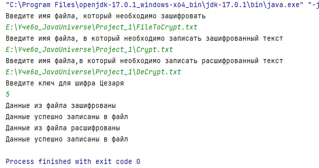
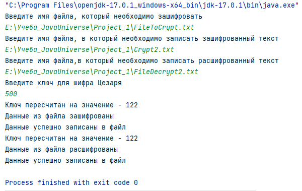
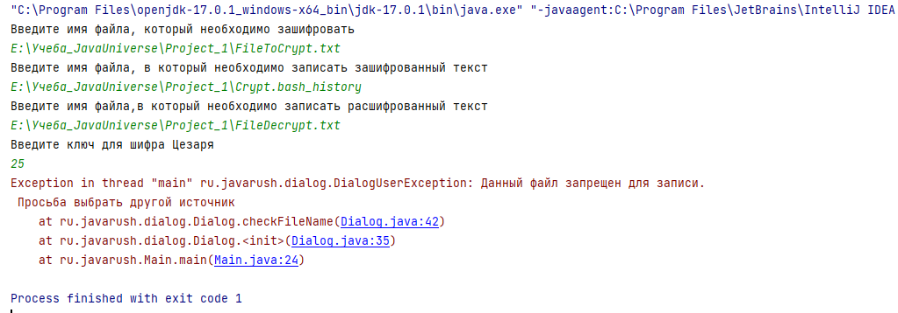

#Криптоанализатор с шифром Цезаря

##Краткое описание проекта

Проект предназначен для шифровки\расшифровки содержимого считанного файла с помощью шифра Цезаря.
Шифр Цезаря — это шифр подстановки: в нем каждый символ в открытом тексте заменяется на символ, который находится на некотором постоянном числе позиций левее или правее него в алфавите. 

##Описание основных классов проекта

Весь проект находится в пакете `package ru.javarush`.
1. В пакете `package ru.javarush.cryptoanalyser` реализована основная функциональность.

    Содержатся классы:

   `Cryptoanalyser` - реализует методы:
   - `checkKey()` - проверка корректности введенного ключа.        
   
   - `encrypt()` - шифрование содержимого считанного файла с указанным ключом и передача шифра для записи.
   
   - `decrypt()` - расшифровка содержимого переданного файла с указанным ключом.

   Словарь задан в статической переменной `char[] ALPHABET`.
     
  `CryptoanalyserExeption` - исключение, генерируемое классом Cryptoanalyser в случае, если передан ключ, кратный длине словаря или 0.

2. В пакете `package ru.javarush.dialog` реализована логика получения исходных данных от пользователя.
    
    Содержатся классы:
   `Dialog` реализует методы:
   - `readFile()`  - проверка указанного файла для чтения и считывание его содержимого с сохранением результата в `List<String>`.
   
   - `checkFileName()` - проверка указанного имени файла для записи.
   
   - `writeFile()` - запись результат шифровки\расшифровки в файл.

      В `Set<String> FORBBIDEN_FILES_NAME` указан список запрещенных для записи файлов и директорий
   
   `DialogUserException` - исключение, генерируемое классом Dialog в случае, если указан запрещенный для записи файл.

3. `Main` - основной класс программы для запуска.
    
    - `Scanner`  - считывает имена файлов для шифровки\расшифровки с консоли.

    - `fileReadName` - имя файла, содержимое которого необходимо зашифровать.

    - `fileWriteNameCrypt` - имя файла, в который записываем зашифрованный текст

    - `fileWriteNameDecrypt` - имя файла, в который записываем расшифрованный текст

##Запуск программы

Перед запуском программы необходимо приготовить файл для шифрования с произвольным текстом.

Содержимое файлов для записи не очищается перед запуском теста. Поэтому файлы для хранения шифра и расшифрованного текста должны быть пустые, иначе данные будут добавлены в конец файла.

Если файлы для записи не найдены, то они будут созданы в указанной директории.

Ключом может быть любое целое число, отличное от кратного 126 (длина словаря).

Запускаем класс `Main`. 

Пользователю последовательно отображаются сообщения с запросом, какую информацию, нужно ввести.

Результат программы зависит от введенных параметров.

##Результаты выполнения тестов
###1. Успешный результат. Передан ключ меньше длины словаря

Подготовлен файл с текстом

Результат запуска программы:

Содержимое файла с шифром:

В словаре отсутствует символ "\", поэтому в шифр передан без изменений.

Содержимое файла с расшифровкой:

Результат: Текст полностью соответствует исходному файлу.

###2. Успешный результат. Передан ключ больше длины словаря, но не кратный ему

Подготовлен файл с текстом:

Запуск программы:

Так как ключ больше длины словаря, то в методе `changeKey` выполнен перерасчет значения ключа.

Содержимое файла с шифром

Содержимое файла с расшифровкой:

Результат:Текст полностью соответствует исходному файлу.

###3. Успешный результат. Передан ключ равный -1

Подготовлен файл с текстом:

Запуск программы:

Содержимое файла с шифром

Содержимое файла с расшифровкой:

Результат:Текст полностью соответствует исходному файлу.

###4. Неуспешный результат. Передан ключ равный 0

Запуск программы

###5. Неуспешный результат. Передан ключ кратный длине словаря

###6. Неуспешный результат. Передан запрещенный файл для записи

